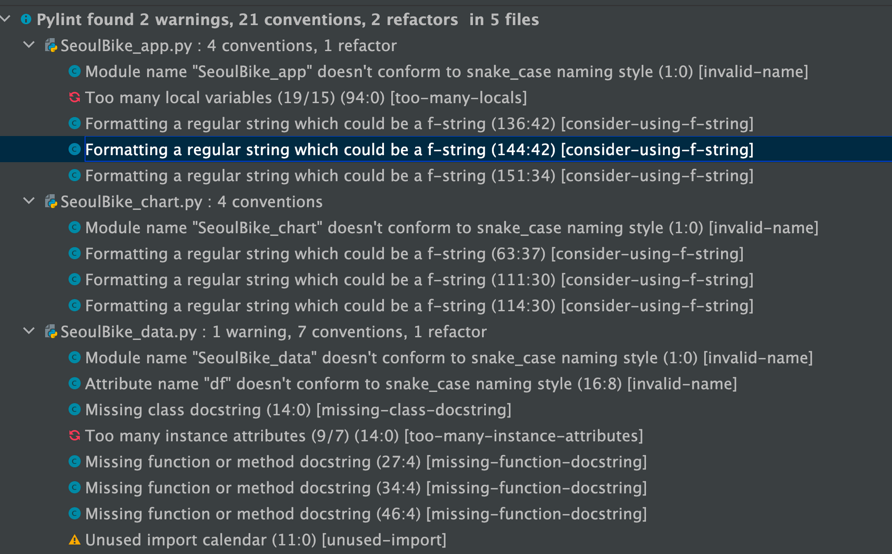
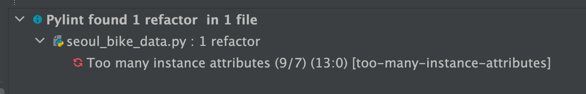
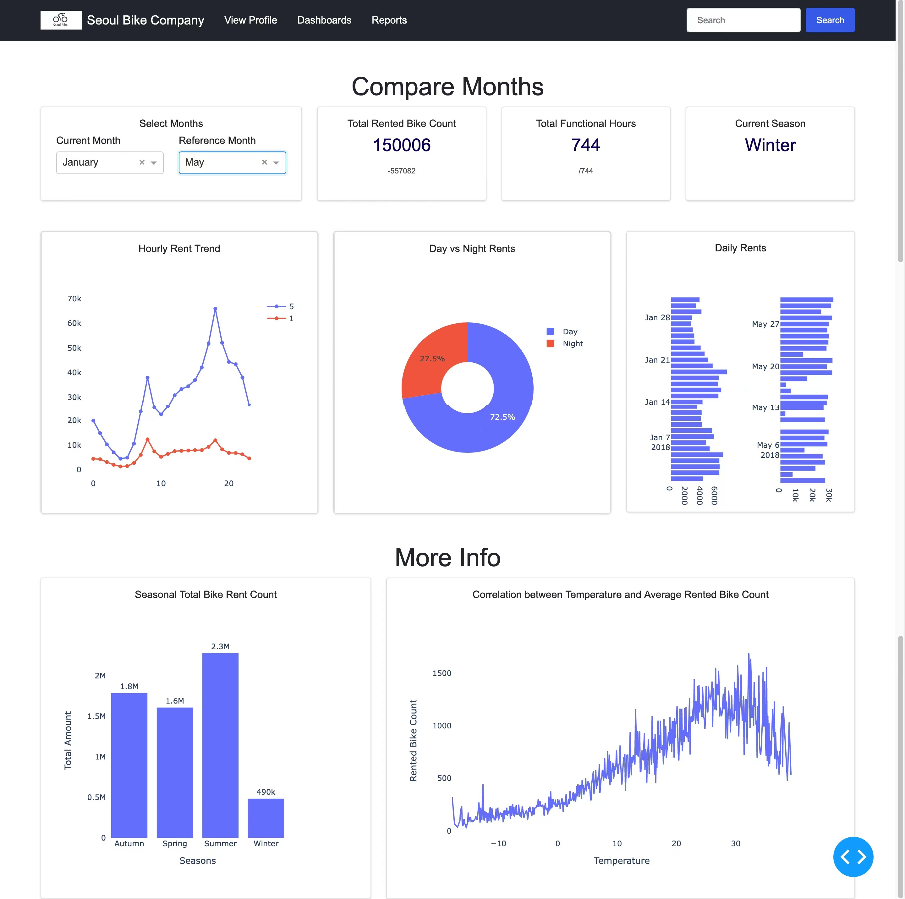

## LOGO

For the navigation bar, a logo for the Seoul Bike Company was designed. It is white so only visible in dark mode in pycharm.
 ## LOGO

A fake company logo was designed for the navigation bar.

## Layout Design

The dashboard was divided into two main parts: Interactive section for target audience to compare several parameters between two different months, and static section to provide genral information. The layout is responsive. However, it was intentionally  designed for pc and opening a full screen. The visualizations are categorized into three rows:

 

- Interactive Text Information
- Interactive charts
- Static charts

## Visualisation 1

### ***Question to address：***

***Which season had the highest total bike rent count?***

### Target audience：

Data analysts and managers from Seoul Bike company.

### Data needed:

'Seasons' and 'Rented Bike Count' fields

### Type of chart and its appropriateness:

Bar chart
We need comparison between different categories(seasons), and the data is discrete. Bar chart is ideal for representing the discrete, numerical comparisons across different seasons[1]. It encodes the value in the length of a bar across an axis, which makes it easy to be understood by human's brain.

### The visual aspects of the design:

Title:   Seasonal Total Bike Rent Count
x-label: Seasons
y-label: Rented Bike Count

- For the bar chart, we shall use 2D bar chart to keep the data accurate.[2]
- Use Vertical Bar Charts because it will give a better visualisation for bar chart representing seasons.[3]
- Keep bar widths consistent. The space between them should be half the width of the bars themselves to give better visual result for target audience(more scientific).[2]
- To give a better **data-ink ratio**, Ditch the grid.

### Evaluation:

The code created for the visualisation successfully meets the design choice—the axis are clear, as well as numbers are labelled on top of each bar, which makes it easy to read and compare for the target audience.

The corners of bars are not round, makes the visuallization looking too classic. Using more advanced tools/libraries to creat round-tip charts might help.

## Visualisation 2

### ***Question to address：***

 ***What is the relationship between average number of bikes rented per hour and the temperature?***

### Target audience：

Data analysts and managers from Seoul Bike company.

### Data needed:

'Temperature' and 'Rented Bike Count' fields

### Type of chart and its appropriateness:

line chart
Line Graphs are used to display quantitative values over a continuous interval(temperature).[3] A Line Graph is most frequently used to show trends and ideal for those data analysts to analyse how the average number of bikes rented per hour has changed with temperature. Under this scenario, we're not interested necessarily in the overall amount; we're looking at the trend and changes under different temperature, which is what the line chart gives us. The gradient of the line tells us whether it's increasing at a high rate or low rate, or if it's flat which means it's not changing at all[4]. This is what makes the line chart the best choice for our data. Line graphs will show trends very clearly and can help to make data analysts to make predictions about the rented bike count at temperature not yet recorded.[5]

### The visual aspects of the design:

Title: Correlation between Temperature and Average Rented Bike Count
x-label: Temperature(°C)
y-label: Average Rented Bike Count

### Evaluation:

The visualization design and the code matched. Due to the limited page width, the trend is very general. However, the plotly go enables the zoom in function which allows target audience to look into details if they want.

## visualisation 3

### ***Question to address：***

***What were the hours during which the rent were the highest?***

### Target audience：

Data analysts and managers from Seoul Bike company.

### Data needed:

'Hour','Rented Bike Count' fields

### Type of chart and its appropriateness:

Line chart
For the use of a line chart, data analysts can follow the change of count over distinct hours, which satisfies the need. Meanwhile, the lines illustrates comparison among different hours. Therefore, the data analysts are able to distinguish peak and over-peak hours. 

### The visual aspects of the design:

Title: Hourly Rent trend.
x-label: Hours
y-label: Rented Bike Count

### Evaluation:

The code meets the design choice.

## visualisation 4

### ***Question to address：***

***What is the distribution of number of bikes rented during day and night?***

### Target audience：

Data analysts and managers from Seoul Bike company.

### Data needed:

'Day_night' and 'Rented Bike Count' fields

### Type of chart and its appropriateness:

Pie chart(**Donut Chart)[7]**
A pie chart works by showing the overall composition of a dataset by encoding the values in the angles. Day and night are two categories. Obviously this nature fits pie chart since pie charts only work well with a minimum number of segments. Three to four is probably about the maximum to deal with. Any more than that and the pie chart starts to get messy. By using a pie chart, it enables the target audience to see the day and night bike rented data comparison at a glance to make an immediate analysis and to understand information quickly.

### The visual aspects of the design:

Title: Bike Rented Count during Day and Night
Arrange slices from largest to smallest, clockwise, and put the largest slice at 12 o’clock.[8]
Remember that pie charts only show part-to-whole relationship, so all slices need to add up to 100%. Uses holes at the centre to make the chart more space-efficient and imporove data-ink ratio.[9][10]

### Evaluation:

The code matched the design choice.

## Visualisation 5

### ***Question to address：***

**How is Daily bike rent count distributed*?***

### Target audience：

Data analysts and managers from Seoul Bike company.

### Data needed:

'month' and 'Rented Bike Count' fields

### Type of chart and its appropriateness:

Bar chart
We need comparison between different dates in a month, and the data is discrete. Bar chart is ideal for representing the discrete and numerical comparisons across different seasons. It encodes the value in the length of a bar across an axis, which makes it easy to be understood by human's brain.

### The visual aspects of the design:

Title:   Daily Rents
x-label: Dates
y-label: Rented Bike Count

- For the bar chart, we shall use 2D bar chart to keep the data accurate.[2]
- Use Horizontal Bar Charts because it will give a better visualisation for bar chart representing multiple days.
- Keep bar widths consistent, the space between them should be half the width of the bars themselves to give better visual result for target audience(more scientific).[2]
- To give a better **data-ink ratio**, Ditch the grid.

### Evaluation:

The code created for the visualisation successfully meet the design choice.

The corners of bars are not round, makes the visuallization looking too classic. Using more advanced tools/libraries to creat round-tip charts might help.

## Color Design

The target audiences are professional, so we shall use consistent colors, as too much variation will distract them from the data.

When choosing color themes, here are some principles followed throughout the project:

First, remember that in most cases monochromatic(single-hue) charts suffice, and there may be no need to introduce the extra dimension of color at all.[4]
Second, refer to the color wheel and standard harmony rules when choosing your palette. Consider the rule of complementary colors—opposites in the color wheel—to find color pairs, such as blue and orange or yellow and purple. Analogous colors, or neighbors in the color wheel, make good palettes, such as orange, red, and pink.[4]

Third, stay away from pure saturated colors.[4]

For the code, the primary color chosen is #636EFA, and the secondary color is #EF553B

### Pylint test 
The test result before corrections:

After corrections:

Since the seoul_bike_data.py was created for contain data variables
for the visualizations, I decided not to remove further instance attributes.

### Webpage layout

### Bibliography

[1]

“12 Design Tips for Awesome Bar Charts,” *Visage*, Nov. 03, 2016. https://visage.co/12-design-tips-bar-charts/.

[2]

M. Francis, “Data Visualization Tips and Tricks Online Class | LinkedIn Learning, formerly Lynda.com,” *LinkedIn*. https://www.linkedin.com/learning/data-visualization-tips-and-tricks (accessed Feb. 10, 2022).

[3]

“Depict Data Studio,” *Depict Data Studio*. https://depictdatastudio.com/when-to-use-horizontal-bar-charts-vs-vertical-column-charts/.

[4]

“Learn Color Design,” *Codecademy*. https://www.codecademy.com/learn/learn-color-design (accessed Feb. 11, 2022).

[5]

“How do we know which heading element to pick?,” *Codecademy Forums*, Mar. 08, 2018. https://discuss.codecademy.com/t/how-do-we-know-which-heading-element-to-pick/297365 (accessed Feb. 11, 2022).

[6]

“https://www.codecademy.com/courses/learn-html/lessons/intro-to-html/exercises/anatomy-html,” *Codecademy*. https://www.codecademy.com/courses/learn-html/lessons/intro-to-html/exercises/anatomy-html.

[7]

“Introduction to Dash Plotly - Data Visualization in Python,” *www.youtube.com*. https://www.youtube.com/watch?v=hSPmj7mK6ng.

[8]

E. Dabbas, *Interactive
 dashboards and data apps with Plotly and Dash : harness the power of a 
fully fledged frontend web framework in Python, no JavaScript required*. Birmingham: Packt Publishing, 2021.

[9]

E. Group, “Advantages and disadvantages of pie charts,” *Excelr.com*, 2018. https://www.excelr.com/advantages-and-disadvantages-of-pie-charts.

[10]

“Donut Chart - Learn about this chart and tools to create it,” *datavizcatalogue.com*. https://datavizcatalogue.com/methods/donut_chart.html (accessed Feb. 11, 2022).

### Appendix

